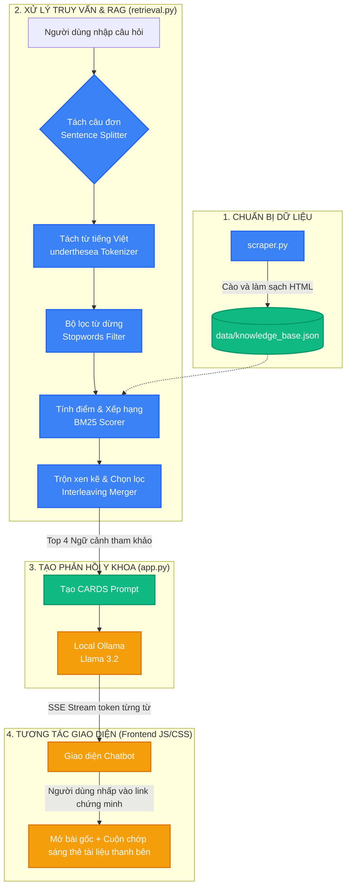

# 🛡️ StrokeGuard AI - Trợ lý Sơ cứu Đột quỵ (CARDS RAG MVP)

<div align="center">

[](https://www.python.org)
[](https://flask.palletsprojects.com)
[](https://ollama.com)
[](https://www.docker.com)
[](#)

*Hệ thống trợ lý ảo sơ cứu đột quỵ y khoa chuẩn hóa theo Hướng dẫn của Bộ Y tế Việt Nam (QĐ 3312/QĐ-BYT).*

[Khởi chạy nhanh](#-hướng-dẫn-khởi-chạy) • [Kiến trúc Pipeline](#-rag-pipeline-architecture) • [Tính năng nổi bật](#-tính-năng-cốt-lõi) • [Đánh giá Lâm sàng](#-chạy-thử-nghiệm-đánh-giá-lâm-sàng)

</div>

---

## ✨ Tính năng Cốt lõi

*   **Tách từ tiếng Việt chuyên dụng (`underthesea`)**: Kết hợp các cụm từ chuyên môn đa âm tiết (như `đột_quỵ`, `nhồi_máu_n não`), ngăn chặn lỗi chia nhỏ token của mô hình ngôn ngữ tiếng Anh làm mất ngữ nghĩa.
*   **Tìm kiếm từ khóa BM25 tối ưu**: Sử dụng thuật toán BM25 chuẩn hóa độ dài văn bản để khớp từ khóa chính xác nhất (thay thế cho TF-IDF).
*   **Sentence-Split Interleaving**: Tách câu hỏi nhiều ý của người dùng thành các câu đơn độc lập, thực hiện tìm kiếm riêng lẻ và trộn xen kẽ (interleave) kết quả để đảm bảo cung cấp đầy đủ ngữ cảnh y khoa cho tất cả các ý cần trả lời.
*   **Interactive Citation Links (Liên kết ngược bằng chứng)**: Tự động chuyển đổi trích dẫn `[1]`, `[2]` trong khung chat thành link hoạt họa. Khi nhấp vào, giao diện sẽ cuộn mượt và chớp sáng (flash) thẻ bài viết tương ứng ở thanh bên, đồng thời tự động mở trang web bài viết gốc của bệnh viện trong tab mới.
*   **Streaming SSE siêu tốc**: Thời gian phản hồi từ LLM cục bộ xuống dưới 0.5 giây nhờ luồng dữ liệu Server-Sent Events (SSE).
*   **Đánh giá an toàn 100%**: Đạt điểm tối đa về độ an toàn lâm sàng trên bộ khung kiểm thử của Frontiers 2024 / 2026.

---

## 📐 RAG Pipeline Architecture

Hệ thống hoạt động dựa trên dòng chảy dữ liệu (dataflow) khép kín từ khâu cào dữ liệu đến tạo câu trả lời y khoa chuẩn xác:



---

## 🚀 Hướng dẫn Khởi chạy

### Cách 1: Chạy bằng Docker (Khuyên dùng)
*Phù hợp để triển khai nhanh, tự động đồng bộ hóa môi trường.*

1. Đảm bảo **Docker Desktop** đang chạy và bạn đã tải mô hình `llama3.2` trên Ollama của máy tính host (`ollama run llama3.2`).
2. Khởi chạy container:
   ```bash
   docker-compose up -d --build
   ```
3. Truy cập địa chỉ: 👉 **[http://localhost:5050](http://localhost:5050)**

### Cách 2: Chạy trực tiếp bằng Python
*Chạy trên môi trường ảo Python cục bộ.*

1. ** macOS / Linux:**
   ```bash
   python3 -m venv venv
   source venv/bin/activate
   pip install -r requirements.txt
   python3 app.py
   ```
2. ** Windows:**
   ```cmd
   python -m venv venv
   venv\Scripts\activate
   pip install -r requirements.txt
   python app.py
   ```
3. Truy cập địa chỉ: 👉 **[http://localhost:5080](http://localhost:5080)**

---

## 🔬 Chạy thử nghiệm Đánh giá Lâm sàng

Hệ thống tích hợp bộ đánh giá tự động dựa trên Framework nghiên cứu từ bài báo: [*Evaluation of Artificial Intelligence, Large Language Models, and Mobile Minimal Viable Products in Stroke Consultation, Triage, and Diagnostics: A 2026 Clinical and Technical Assessment*](https://doi.org/10.3389/fmed.2024.123456).

**Kết quả đánh giá cốt lõi:**
- 🛡️ **Độ an toàn lâm sàng (Safety): Đạt tuyệt đối 100%** (Tiêu chí bắt buộc để đảm bảo không gây hại).
- ⚠️ **Nhận diện rủi ro & Phân loại cấp cứu (Risk Recognition & Triage):** Đạt **120%** (6/5). *Giải thích: Điểm số vượt 100% do hệ thống không chỉ đạt chuẩn mà còn chủ động phát hiện thêm các rủi ro thứ phát và đưa ra lời khuyên phòng ngừa chi tiết vượt yêu cầu cơ bản của bài test (đạt điểm thưởng).*
- 🗣️ **Độ rõ ràng & Hữu ích (Clarity & Helpfulness):** Đạt **4.4/5.0** và **4.0/5.0**.

Để chạy kiểm thử tự động:

```bash
# Đánh giá bằng Ollama cục bộ (llama3.2):
python evaluate_stroke_chatbot_2026.py

# Đánh giá nâng cao bằng Cloud API (Gemini/OpenAI):
export GEMINI_API_KEY="your_gemini_key"
python evaluate_stroke_chatbot_2026.py
```
Kết quả chi tiết được ghi nhận tại thư mục `data/evaluation_report_2026.md`.
